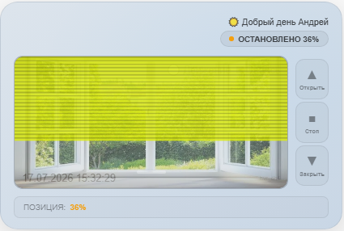
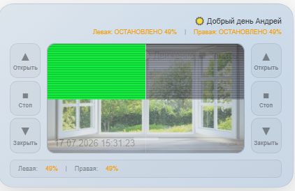
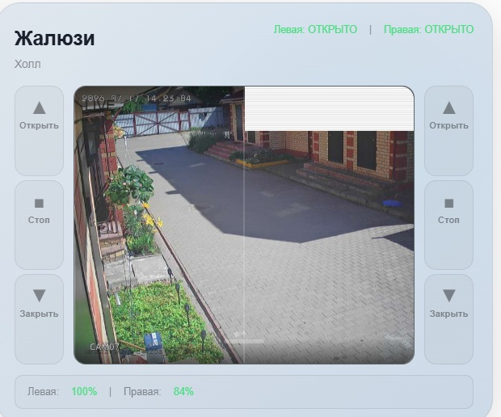
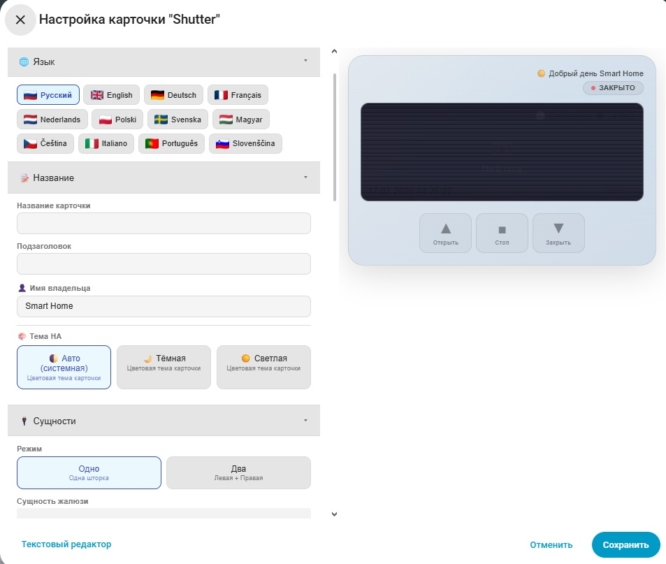
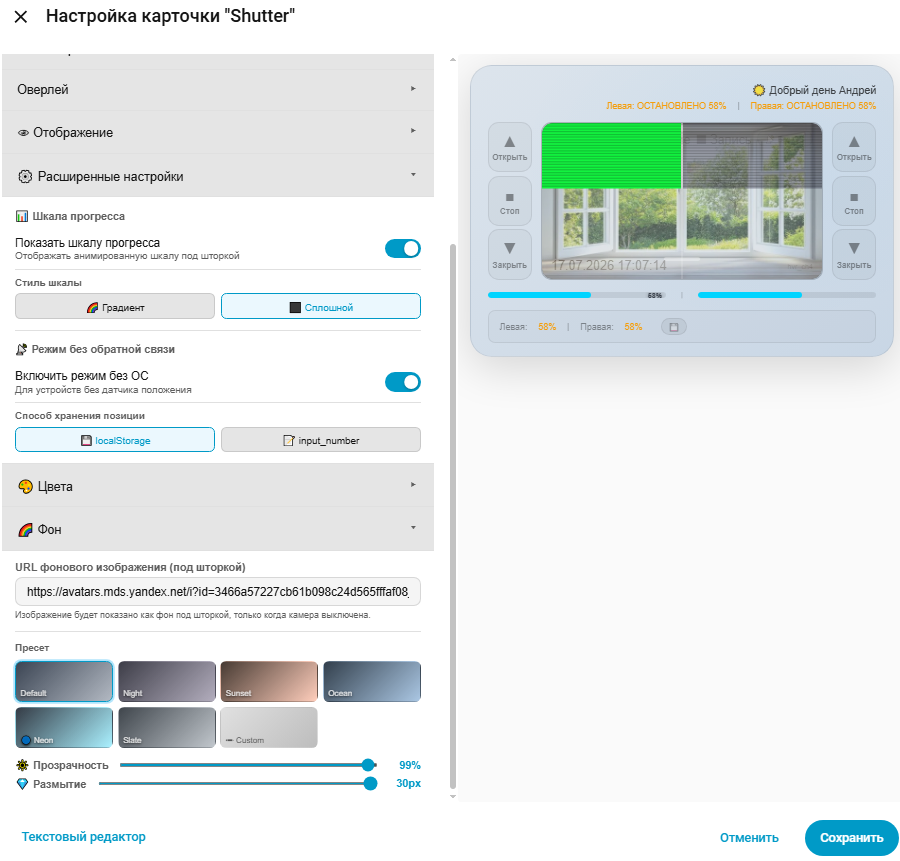

# HA Shutter Card

[](https://github.com/hacs/integration)


Пользовательская карточка для Home Assistant Lovelace, предназначенная для управления шторами, жалюзи и рольставнями. Поддерживает отображение текущего положения, перетаскивание для управления, детализированную анимированную шторку, встроенную камеру с оверлеем, фоновое изображение и полностью настраиваемый интерфейс.

**Не требует дополнительных плагинов. Работает автономно, полностью настраивается через встроенный редактор UI.**

---

## 📸 Превью

<div style="display: flex; gap: 10px; flex-wrap: wrap;">
  
  
    
</div>

---

## 🎛️ Визуальный редактор




## ✨ Возможности (v1.0.0)

### 🎨 Отображение и интерфейс
- 🚪 **Основной экран** — название, текущее положение с цветовой индикацией
- 📊 **Перетаскивание** — управление положением шторки перетаскиванием по камере/фону
- 🔄 **Индикатор состояния** — отображение статуса (открыто/закрыто/открывается/закрывается/остановлено)
- 🎯 **Детализированная шторка** — 24 планки с плавной анимацией открытия/закрытия и прозрачностью
- 📷 **Встроенная камера** — отображение видеопотока с оверлеем (LIVE, время, движение, запись)

### 🏠 Режимы работы
- **🔄 Одинарный режим** — управление одной шторкой
- **🔄🔄 Двойной режим** — независимое управление левой и правой шторкой на одной карточке

### 🎛️ Панель управления
- **3 кнопки** — Открыть / Стоп / Закрыть с цветовой индикацией
- **Расположение кнопок** — сверху/снизу/слева/справа (одинарный режим)
- **Раздельное управление** — для двойного режима кнопки слева и справа

### 🎨 Визуальная настройка
- **7 готовых градиентов фона** — Default, Night, Sunset, Ocean, Neon, Slate, Custom
- **5 цветовых настроек** — Акцент, Текст, Открыто, Закрыто, Цвет шторки (RGBA)
- **🖼️ Фоновое изображение** — пользовательское изображение под шторкой (при выключенной камере)
- **Размытие и прозрачность** — настройка фона карточки
- **Настройка оверлея** — включение/отключение времени, движения, записи

### 🌐 Поддержка языков (12 языков)
- 🇬🇧 English / 🇨🇿 Čeština / 🇩🇪 Deutsch / 🇫🇷 Français
- 🇮🇹 Italiano / 🇭🇺 Magyar / 🇳🇱 Nederlands / 🇵🇱 Polski
- 🇵🇹 Português / 🇷🇺 Русский / 🇸🇮 Slovenščina / 🇸🇪 Svenska

### 🔄 Дополнительные функции
- **Инвертирование позиции** — если датчик выдаёт 100% при закрытом положении
- **Приветствие** — персонализированное приветствие по времени суток
- **Гибкое управление статусом** — отдельные настройки для отображения статуса и позиции


---

## 🎯 Новые возможности v1.1.0
###  📊 Шкала прогресса
- Отображается под шторкой
- Два стиля: градиентный и сплошной
- Анимация при движении
- Показывает процент при наведении

### 📡 Режим без обратной связи
- Для устройств без датчика положения
- Хранит позицию в localStorage или input_number
- Сохраняет положение при перезагрузке
- Эмулирует визуальное закрытие и открытие шторок

### 📱 Мобильная адаптация
- Адаптивная верстка для экранов до 500px
- Кнопки управления компактные, но с текстом и иконками
- В режиме "Две шторки": кнопки левой шторки выравнены по левому краю, правой — по правому
- В режиме "Одна шторка": кнопки по центру
- Уменьшенные размеры элементов для удобства на мобильных устройствах
- Камера занимает всю ширину, располагаясь между рядами кнопок
- Прогресс-бар и статус-бар адаптированы под мобильные экраны

---

###  💾 Два способа хранения
- localStorage (по умолчанию)
Хранится: в браузере пользователя

Плюсы: не требует создания сущностей в HA

Минусы: сбрасывается при очистке кэша браузера, не синхронизируется между устройствами

- input_number (рекомендуется)
Хранится: в Home Assistant (в базе данных)

Плюсы: сохраняется при перезагрузке HA, синхронизируется между устройствами, доступен в автоматизациях

Минусы: нужно создать сущность в HA

```yaml
input_number:
  shutter_position:
    name: Позиция шторки
    min: 0
    max: 100
    step: 1
    mode: slider
    icon: mdi:window-shutter
```

---




---


## 📦 Установка

### Способ 1 — HACS (рекомендуется)

**Шаг 1:** Добавьте пользовательский репозиторий в HACS:

[](https://my.home-assistant.io/redirect/hacs_repository/?owner=yourusername&repository=ha-shutter-card&category=plugin)

> Если кнопка не работает, добавьте вручную:
> **HACS → Панель → ⋮ → Пользовательские репозитории**
> → URL: `https://github.com/yourusername/ha-shutter-card` → Тип: **Панель** → Добавить

**Шаг 2:** Найдите **HA Shutter Card** → **Установить**

**Шаг 3:** Жёстко обновите браузер (`Ctrl+Shift+R`)

---

### Способ 2 — Ручная установка

1. Скачайте [`ha-shutter-card.js`](https://github.com/yourusername/ha-shutter-card/releases/latest)
2. Скопируйте в `/config/www/ha-shutter-card.js`
3. Перейдите в **Настройки → Панели → Ресурсы** → **Добавить ресурс**:

| Параметр | Значение |
|----------|----------|
| URL | `/local/ha-shutter-card.js` |
| Тип ресурса | `JavaScript Module` |

---

## 🚀 Примеры использования

### Одинарный режим
```yaml
type: custom:shutter-card
entity_id: cover.kitchen_window
camera_entity: camera.kitchen_view
title: Кухонное окно
color_blind: "rgba(26, 26, 46, 0.85)"
```


### Двойной режим
```yaml
type: custom:shutter-card
mode: dual
left_entity_id: cover.kitchen_left
right_entity_id: cover.kitchen_right
camera_entity: camera.kitchen_view
title: Кухонные окна
left_color_blind: "rgba(26, 26, 46, 0.85)"
right_color_blind: "rgba(44, 44, 64, 0.85)"
```

### Без камеры (с фоновым изображением)
```yaml
type: custom:shutter-card
entity_id: cover.living_room
show_camera: false
bg_image: "/local/window_background.jpg"
title: Гостиная
color_blind: "rgba(26, 26, 46, 0.7)"
```


---

## 🐛 Сообщение об ошибках

- Если вы нашли ошибку, пожалуйста, создайте Issue с описанием:
- Версия карточки
- Версия Home Assistant
- Тип устройства (шторка/жалюзи/рольставни)
- Конфигурация карточки
- Логи браузера (F12 → Console)
- Ожидаемое и фактическое поведение

---

## 🤝 Вклад в развитие

- Форкните репозиторий
- Создайте ветку для вашей фичи (git checkout -b feature/amazing-feature)
- Зафиксируйте изменения (git commit -m 'Add some amazing feature')
- Отправьте в ваш форк (git push origin feature/amazing-feature)
- Откройте Pull Request

---

### 📝 Приоритет для добавления в следующие версии:

- Наклон ламелей (tilt) — важно для жалюзи
- Защита от конфликтов — безопасность
- Анимация/иконки статуса — визуальное улучшение
- Маркизы — поддержка дополнительных устройств


---

## 📜 Лицензия

MIT License — свободное использование, модификация и распространение.
Если проект оказался полезным, пожалуйста, поставьте ⭐ звезду репозиторию!

---

## 🙏 Благодарности

### Основано на:

- gate-card
- pic-shutter-card
- advanced-camera-card
